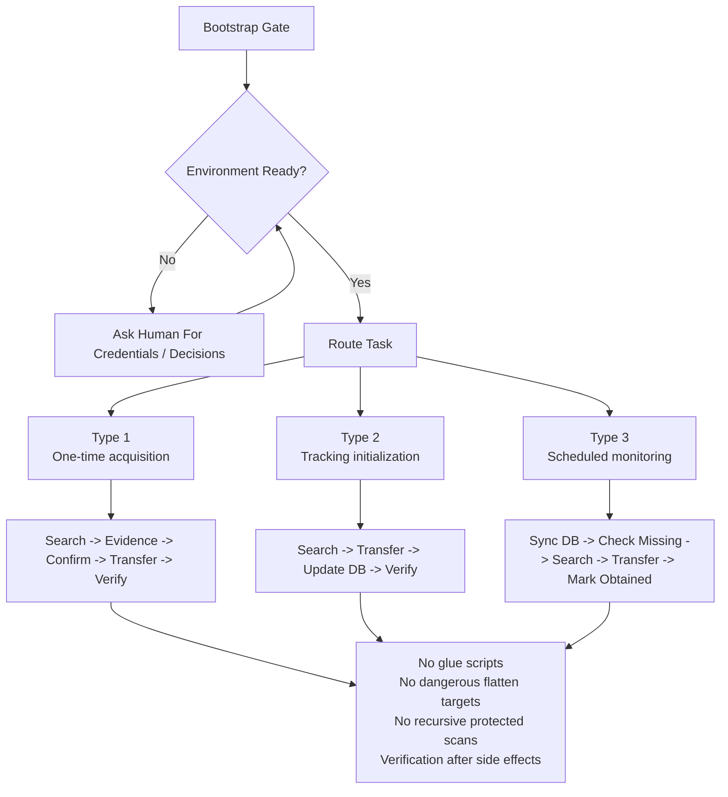

# clawd-media-track

`clawd-media-track` is a configuration-driven agent skill and runtime for acquiring and monitoring media resources.

It is built for people who want an agent to help them get movies, TV shows, or anime into 115 cloud storage without relying on guesswork, one-off scripts, or manual repetition.

This repository is the public rebuild of a private agent workflow. It keeps the original operating philosophy, removes machine-specific assumptions, and turns the system into something advanced users can actually understand and bootstrap.

## What This Skill Solves

Most agentic media workflows fail in one of two ways:

- they can search, but they do not know what is actually missing
- they can transfer files, but they do not verify what landed, what duplicated, or what still needs tracking

`clawd-media-track` treats that as a state problem, not just a search problem.

It combines:

- `TMDB` for metadata and release status
- `PanSou` for resource search
- `115` for storage and file operations
- a local database for tracking season-level state

The goal is simple:

- let a human ask for a resource
- let an agent acquire it with evidence-first steps
- let the system keep track of what is still missing
- let a scheduled agent come back later and fill the gaps

## Core Idea

This skill is built around one rule:

`the agent should act from evidence and state, not vibes`

That shows up in a few design choices:

- acquisition is split into different task types
- the database acts as a state machine for tracked seasons
- side effects are verified after they happen
- destructive or high-blast-radius 115 operations are guarded
- the skill prefers explicit workflow rules over clever parsing tricks

In practice, the system does not ask the agent to "just go find stuff."
It asks the agent to:

1. identify what kind of task this is
2. inspect the current state
3. gather evidence
4. make a bounded decision
5. execute only after confirmation
6. verify the result

## Workflow Overview

## Task Types

The workflow is split into three task types.

### Type 1: One-Time Acquisition

Use Type 1 when the target can be acquired as a one-time task.

Typical cases:

- a movie
- a completed series with full coverage available

Type 1 focuses on:

- TMDB lookup
- PanSou search
- selecting the best covering resource
- transferring into 115
- flattening
- deduplicating
- final verification

No long-term tracking is created.

### Type 2: Tracking Initialization

Use Type 2 when the target cannot be cleanly finished in one shot.

Typical cases:

- an ongoing season
- a completed season with incomplete resource coverage

Type 2 does everything Type 1 does, then adds:

- database initialization
- save directory binding
- TMDB sync
- marking the episodes already obtained

This is where the workflow turns from "get me this" into "track this season until it is complete."

### Type 3: Scheduled Monitoring

Use Type 3 for recurring follow-up.

Type 3 is the automation loop:

- sync tracked shows with TMDB
- check what is still missing
- inspect the existing 115 files first
- search PanSou only for uncovered gaps
- transfer carefully
- flatten and deduplicate safely
- mark newly obtained episodes

This is why the skill is especially well suited to an agent platform that supports cron or scheduled execution.

## Why the Database Matters

The database is not just a cache.
It is the state machine that tells the agent what is missing and what to do next.

The tracking unit is:

`one show + one season`

That means:

- even a one-season domestic drama is treated as `Season 1`
- a finished earlier season does not need to stay coupled to a still-airing later season
- the agent always reasons about a specific season's missing episodes

This keeps the workflow clean:

- Type 1 finishes and stops
- Type 2 initializes tracking when coverage is incomplete
- Type 3 comes back only for seasons that still need attention

## Local State

This repository keeps tracking state in a local SQLite database file:

- `tracking.db`

That file is intentionally gitignored.

It is local runtime state, not repository content.

You do not need a separate manual database bootstrap step.
The current database module creates the database file and table automatically when it is first used.

In practice, that means:

- Type 1 does not need the database
- Type 2 will create local tracking state the first time tracking is initialized
- Type 3 will reuse that existing local tracking state

## Bootstrap

Before the skill can do normal work, it has to be bootstrapped.

Bootstrap has two stages:

### Step 1: Environment Setup

The agent and human work together to prepare:

- Python environment and dependencies
- `TMDB_READ_TOKEN`
- `PAN115_COOKIE`
- `PANSOU_BASE_URL`

This is intentionally cooperative.
Some things can only be provided or approved by a human.

### Step 2: 115 Workspace Initialization

Once 115 access is verified and the human approves, the agent creates or reuses the default workspace:

- `clawd-media`
- `Movies`
- `TV Shows`
- `Anime`

Then it writes the resulting CID values into `.env`.

For the exact init flow, read:

- [Bootstrap Init](references/00-bootstrap-init.md)

## Agent Compatibility

Any tool-calling agent can use this skill for:

- bootstrap
- Type 1
- Type 2

But Type 3 changes the picture.

Because Type 3 is a scheduled monitoring workflow, this project is best paired with an agent platform that can run recurring jobs.

That is why an agent environment like `OpenClaw`, or any other setup that supports scheduled runs, is a strong fit:

- it can run on a schedule
- it can come back after release updates
- it can continue a database-backed tracking loop

Without scheduled execution, the skill still works well for one-off and initialization tasks, but you lose the full value of automated follow-up.

If your agent environment runs continuously and supports scheduled jobs, you can use the example host prompt in [docs/openclaw-type3-example.md](docs/openclaw-type3-example.md) as the basis for configuring a recurring Type 3 run.

In practice, that means a user can ask an OpenClaw-style agent, or any other 24x7 agent with cron-style scheduling, to create a daily Type 3 monitoring job from that example.

If you want to use this skill with OpenClaw, clone this repository into the OpenClaw skills directory so the resulting path is `clawd/skills/clawd-media-track/`. A normal `git clone <repo-url>` run inside `clawd/skills` will create that `clawd-media-track` folder automatically. Only if you explicitly clone into an existing target directory will the repository contents land directly in that directory.

## PanSou: Public vs Self-Hosted

`pansou-web` is required as the search backend, but self-hosting is optional.

You can either:

- use a public PanSou-compatible service for the fastest setup
- deploy your own `pansou-web` container for more control

The public path is good for quick bootstrap and normal use.
A self-hosted deployment is better if you want independence or more stable control over the search backend.

## Dependencies and Upstream Projects

This repository is built on top of a few upstream tools and projects.

### Required Runtime Dependency

- [`p115client`](https://github.com/ChenyangGao/p115client)
  - used for 115 API access and file operations
  - this is a direct runtime dependency of the Python modules in this repository

### Required Search Backend

- [`fish2018/pansou-web`](https://github.com/fish2018/pansou-web)
  - used as the resource search backend
  - this skill expects a reachable `PANSOU_BASE_URL`
  - users can either:
    - point to a public PanSou-compatible service
    - or deploy their own `pansou-web` instance

### Bootstrap Helper

- [`115 Cookie Manager`](https://chromewebstore.google.com/detail/115-cookie-manager/eommpjdhnkhahmekjplnkmnfbbjgpigp)
  - used during bootstrap to obtain a full 115 cookie string
  - this is not a runtime dependency of the skill itself
  - it is a verified helper for the human side of bootstrap

In short:

- runtime needs: `p115client`, a reachable `pansou-web`-compatible backend, 115 access, and TMDB access
- bootstrap may additionally use helper tools such as `115 Cookie Manager` to obtain credentials

### Important Note

This repository is an independent workflow built around those upstream tools.

It is:

- not the official repository for `p115client`
- not the official repository for `pansou-web`
- not affiliated with 115 or TMDB

The goal of this project is to provide an agent-facing workflow that uses those upstream pieces in a disciplined, state-driven way.

## Safety Model

This repository takes 115 safety seriously.

The runtime includes guardrails for the two biggest failure modes:

- flattening the wrong directory
- recursively scanning protected directories too aggressively

Examples:

- `flatten_directory()` only accepts safe final landing directories
- root/media/category directories are protected
- `list_files()` is shallow by default
- deep scans on protected directories are blocked

The skill also requires:

- evidence before critical decisions
- confirmation before side effects
- verification after side effects

## Who This Is For

This project is for advanced users who are comfortable with:

- local Python environments
- API credentials
- 115 cloud storage
- agent-driven workflows

It is not trying to be a one-click consumer product.

The goal is different:

- honest setup
- explicit workflow logic
- reproducible state
- credible automation

## Minimal First Run

The shortest realistic first-run path looks like this:

1. create the local Python environment and install dependencies
2. obtain `TMDB_READ_TOKEN`
3. obtain `PAN115_COOKIE`
4. decide whether to use the public PanSou service or a self-hosted `pansou-web` instance
5. tell the agent which PanSou path you want; the agent will then validate it and write the resulting `PANSOU_BASE_URL` into `.env`
6. approve Step 2 so the agent can create or reuse `clawd-media`, `Movies`, `TV Shows`, and `Anime`
7. after CID values are written back, begin normal Type 1 / Type 2 / Type 3 work

For the exact bootstrap protocol, see [Bootstrap Init](references/00-bootstrap-init.md).

## Repository Structure

- [SKILL.md](SKILL.md): main skill entrypoint
- [references/00-bootstrap-init.md](references/00-bootstrap-init.md): bootstrap gate and init flow
- [references/05-type1-checklist.md](references/05-type1-checklist.md): one-time acquisition checklist
- [references/06-type2-checklist.md](references/06-type2-checklist.md): tracking initialization checklist
- [references/07-type3-checklist.md](references/07-type3-checklist.md): scheduled monitoring checklist
- [docs/openclaw-type3-example.md](docs/openclaw-type3-example.md): example host prompt for scheduled Type 3 runs
- [scripts](scripts): runtime modules
- [tests](tests): module tests

## Current Status

This public rebuild already has:

- configuration-driven runtime modules
- bootstrap/init documentation
- season-level tracking logic
- tested 115 safety guardrails
- Type 1 and Type 2 workflow design carried over into the public repo

What it still assumes:

- a human can provide external credentials and approval where needed
- the runtime is being used by a capable tool-calling agent
- Type 3 automation is best handled by a scheduled agent environment

## Current Limitations

- this is a skill repo for advanced users, not a one-click consumer product
- the current default runtime is 115-centered, so the out-of-the-box workflow assumes usable 115 access and is most practical with a 115 membership
- the `pansou-web` self-hosted path is documented clearly, but still mainly documentation-driven rather than fully automated
- the full value of Type 3 depends on an agent environment that supports scheduled runs
- bootstrap is cooperative by design: some credentials and approvals must still come from a human

## Adaptation Notes

This repository is currently implemented around a 115-centered runtime, but the workflow design itself is broader than 115.

Advanced users can adapt the storage and execution layer to fit their own environment, for example:

- a NAS
- a local download directory
- another storage or post-processing workflow

In that kind of localized setup:

- `TMDB` can still drive release status and season progress
- `pansou-web` can still provide search results and magnet candidates
- the local database can still track what is missing

The main thing that changes is the execution layer after resource selection.

In other words:

- this public repository does not currently ship a full non-115 runtime
- but the skill logic is intentionally extensible enough to be localized for users who want magnet-based or local-storage workflows instead of 115

## Philosophy

This repository is opinionated on purpose.

It prefers:

- one step at a time
- evidence before action
- verification after side effects
- state-driven decisions over guesswork
- explicit constraints over "smart" improvisation

That is the whole point of the rebuild.
